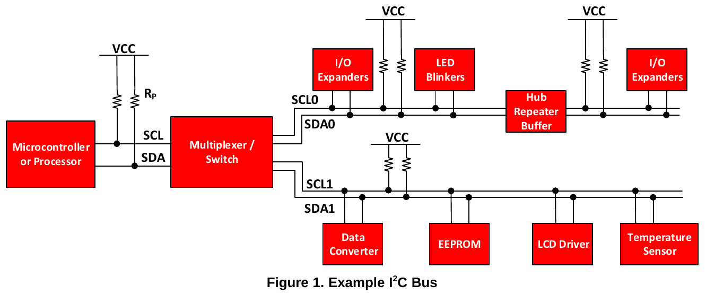
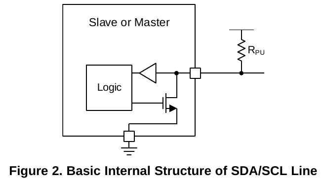
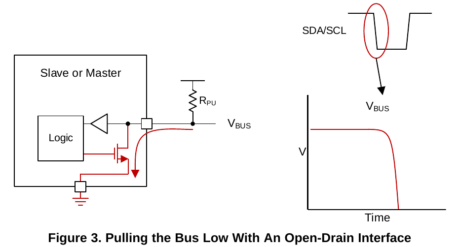
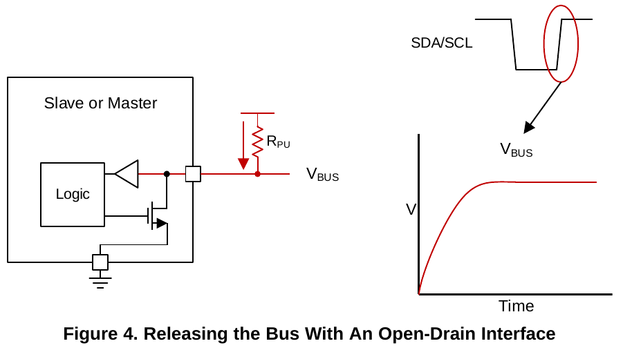
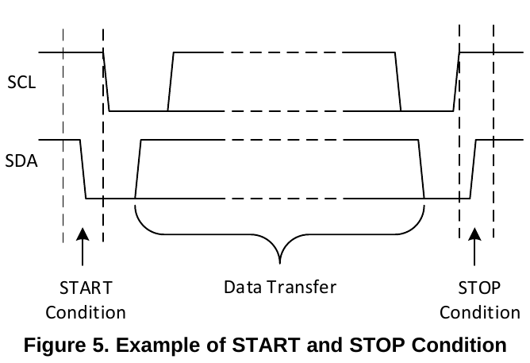
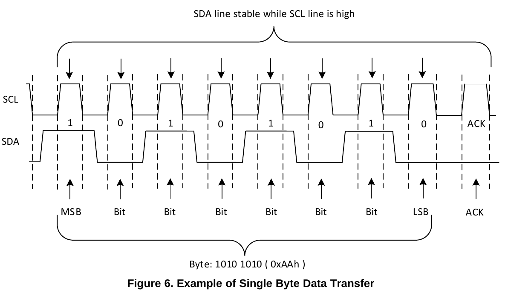
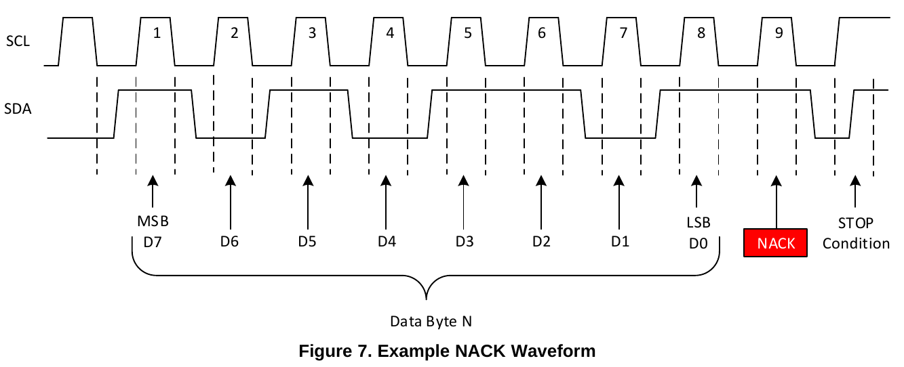
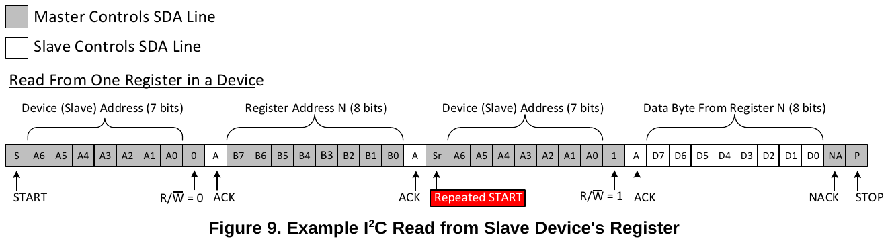

IIC
====

_本文翻译自《[Understanding the I2C Bus](http://www.ti.com/lit/an/slva704/slva704.pdf)》，作者Jonathan Valdez, Jared Becker。_

## 目录
- [摘要](#abstract)
- [1. 电气特性](#electrical_characteristics)
- [2. IIC接口](#iic_interface)
- [3. IIC数据传输](#iic_data)

## <a name="abstract">摘要</a>
I2C总线是一种非常流行且功能强大的总线，用于单个主设备或多个主设备与单个或多个从设备之间的通信。

<a href="#figure-1">图1</a>说明了多个不同的外设可以共享一条总线，该总线仅通过2条线连接到处理器（或者控制器），这是与其他接口相比，I2C总线最大的优点之一。

本应用笔记旨在帮助用户了解I2C总线的工作原理。

<a href="#figure-1">图1</a>显示了嵌入式系统的典型I2C总线，其中使用了多个从器件。
微控制器代表I2C主控制器，并控制IO扩展器，各种传感器，EEPROM，ADC/DAC等等。
所有这些都只由主机的2个引脚控制。

## <a name="electrical_characteristics">1. 电气特性</a>
I2C在同一条线路上使用开漏/开路集电极和输入缓冲器，允许单条数据线用于双向数据流。

### 1.1 用于双向通信的漏极开路
开漏指的是一种输出，它可以将总线拉低到一个电压（在大多数情况下接地），或者“释放”总线并通过上拉电阻将其上拉。

如果总线被主机或从机释放，则线路上的上拉电阻（RPU）负责将总线电平拉置高电平。
由于没有设备可以强制线路出现高电平，所以这意味着总线将永远不会遇到通信问题，如果其中一个设备尝试发送高电平，而另一个设备发送低电平，这会引起短路（电源直接到地）。

I2C要求如果多主机环境中的主机发送高电平，但是检测到线路为低电平（被另一台设备将其拉低），则应停止通信，因为另一台设备正在使用总线。（低电平优先）

推挽式接口不允许这种类型的自由通讯，这是I2C的一个优点。

<a href="#figure-2">图2</a>展示了SDA/SCL线上从器件或主器件的内部结构的简化视图，
包括用于读取输入数据的缓冲器和用于传输数据的下拉场效应管（FET）。

器件只能将总线拉低（提供对地短路）或释放总线（高阻抗接地）并允许上拉电阻升高电压。

这是处理I2C器件时要实现的一个重要概念，因为没有器件可以将总线保持为高电平（器件只能拉低，释放由上拉电阻拉高）。
此属性允许进行双向通信。

#### 1.1.1 漏极开路下拉总线
如上一节所述，漏极开路的设计只将总线拉低，或“释放”它并让上拉电阻将其拉高。

<a href="#figure-3">图3</a>展示了将总线拉低的电流。
想要传输低电平的逻辑将激活下拉场效应管，这将提供接地短路，将线拉低。

#### 1.1.2 漏极开路释放总线
当从机或主机希望传输逻辑高电平时，它只需通过关闭下拉FET（场效应管）来释放总线。

这使得总线电压上浮，并且上拉电阻器将总线电压上拉到电源电压，这将被解释为高电平。

<a href="#figure-4">图4</a>展示了通过上拉电阻的电流流动，该电阻将总线拉高。

## <a name="iic_interface">2. IIC 接口</a>
### 2.1 通用I2C操作
I2C总线是标准双向接口，控制器/处理器作为主机与从设备通信。
除非已由主设备寻址，否则从设备不能主动传输数据。
I2C总线上的每个器件都有一个特定的器件地址，以区分同一I2C总线上的多个器件。
许多从设备在启动时将需要配置以设置设备的行为。
这通常在主器件访问具有唯一寄存器地址的从器件内部寄存器映射时完成。
设备可以有一个或多个寄存器，用于存储，写入或读取数据。

物理I2C接口由串行时钟（SCL）和串行数据（SDA）线组成。
SDA和SCL线都必须通过上拉电阻连接到VCC。
上拉电阻的大小由I2C总线上的电容量决定（更多详细信息，请参考I2C上拉电阻计算的文章（[SLVA689]）。
只有在总线空闲时才可以启动数据传输。
如果在STOP条件后SDA和SCL线均为高电平，则总线被视为空闲。

主设备访问从设备的一般过程如下：

- 假设主设备想要向从设备发送数据：
    1. 主发送器发送START条件并寻址从接收器
    2. 主发送器将数据发送到从接收器
    3. 主发送器以STOP条件终止传输
- 如果主设备想要从从设备接收/读取数据：
    1. 主发送器发送START条件并寻址从接收器
    2. 主接收器发送请求读取的寄存器
    3. 主接收器从从发送器接收数据
    4. 主发送器以STOP条件终止传输

#### 2.1.1 START和STOP条件
与主设备的I2C通信由主设备发送START条件启动，并由主设备发送STOP条件终止。
当SCL为高电平时，SDA线上由高到低的转换定义了START条件。
当SCL为高电平时，SDA线上由低到高的转换定义了STOP条件。

#### 2.1.2 重复启动条件
重复START条件类似于START条件，用来在不使总线空闲的状态下重新开始传输。
它看起来与START条件相同，但与START条件不同，因为它发生在STOP条件之前（当总线不空闲时）。
这对于主设备希望开始新通信但是不希望总线在STOP条件下空闲时非常有用，否则这可能导致主设备失去对另一个设备的控制权（在多主环境中）。

### 2.2 数据有效性和字节格式
在SCL的每个时钟脉冲期间传输一个数据位。
一个字节由SDA线上的8位组成。
字节可以是器件地址，寄存器地址，也可以是写入从器件或从器件读取的数据。
数据首先传输最高位（MSB）。
在START和STOP条件之间，可以从主向从传输任意数量的数据字节。
SDA线上的数据必须在时钟周期的高电平期间保持稳定，因为当SCL为高电平时数据线的变化被解释为控制命令（START或STOP）。

### 2.3 确认（ACK）和不确认（NACK）
每个数据字节（包括地址字节）后跟一个来自接收方的ACK位。
ACK位表示接收器与发送器通信，该字节已成功接收，并且可以发送另一个字节。

在接收方发送ACK之前，发送方必须释放SDA线。
要发送ACK位，接收器应在ACK/NACK相关时钟周期（第9周期）的低相位期间下拉SDA线，以便在ACK的高相位期间SDA线稳定为低电平。

当在ACK/NACK相关时钟周期期间SDA线保持高电平时，这被解释为NACK。
有几个条件会导致生成NACK：

1. 通信方无法接收或发送，因为它正在执行某些实时功能，并且尚未准备好开始与主站通信。
2. 在传输期间，接收方获取它不理解的数据或命令。
3. 在传输期间，接收方不能再接收任何数据字节。
4. 主接收器完成读取数据并通过NACK向从设备指示。

## <a name="iic_data">3. IIC 数据传输</a>
数据必须是向从设备发送或从从设备接收，但实现此目的的方式是通过从或从从设备中的寄存器读取或写入。

寄存器是从机存储器中的位置，包含信息，无论是配置信息，还是要发送回主机的一些采样数据。
主设备必须将信息写入这些寄存器，以指示从设备执行任务。

虽然在I2C从设备中通常有寄存器，但请注意并非所有从设备都有寄存器。
有些器件很简单，只包含1个寄存器，可以通过在从地址之后立即发送寄存器数据直接写入，而不是寻址寄存器。

单寄存器设备的示例是8位I2C开关，其通过I2C命令控制。

由于它有1位来启用或禁用通道，因此只需要1个寄存器，并且主器件仅在从地址之后写入寄存器数据，跳过寄存器编号。

### 3.1 向从器件写入数据
要在I2C总线上写入，主器件将在总线上发送带有从器件地址的起始条件，并且最后一位设置为0的（R/W位），这表示写入。
从器件发送应答位后，主器件将发送它希望写入的寄存器的寄存器地址。
从机将再次确认，让主机知道它准备好了。
在此之后，主设备将开始将数据发送到从设备的寄存器，直到主设备发送了所需的所有数据（有时这只是一个字节），主设备将以STOP条件终止传输。

<a href="#figure-8">图8</a>显示了将单个字节写入从寄存器的示例。

### 3.2 从从机读取数据
从从机中读取与写作非常相似，但需要一些额外的步骤。
为了从从机读取，主机必须首先向从机指示它希望从哪个寄存器读取。
这是由主设备以与写入类似的方式开始传输，通过发送R/W位等于0（表示写入）的地址，然后是希望从中读取的寄存器地址。
一旦从机确认该寄存器地址，主机将再次发送START条件，然后是从机地址，R/W位设置为1（表示读取）。
这次，从器件将确认读取请求，主器件释放SDA总线，但将继续向从器件提供时钟。
在通讯的这一部分期间，主设备将成为主接收器，从设备将成为从发送器。

主机将继续发送时钟脉冲，但将释放SDA线，以便从机可以传输数据。
在每个数据字节结束时，主设备将向从设备发送ACK，让从设备知道它已准备好接收更多数据。
一旦主设备收到了预期的字节数，它就会发送一个NACK，向从设备发出信号以停止通信并释放总线。然后主机将以STOP条件结束通讯。

<a href="#figure-9">图9</a>显示了从从寄存器读取单个字节的示例。

[SLVA689]: http://www.ti.com/lit/an/slva689/slva689.pdf