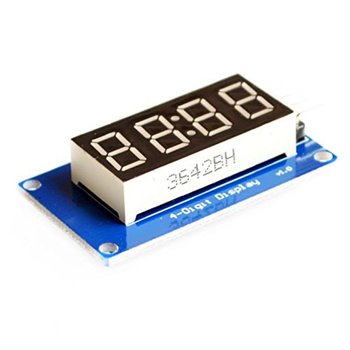

TM1637-4位数码管显示模块
====

### 预览


### API

#### 1. 设置亮度
```c
#define tm1637_set_brightness(brightness_level)
```

亮度分为8个等级：

- TM1637_BRIGHTNESS_LEVEL_1   `(0x88 | 0x00)`
- TM1637_BRIGHTNESS_LEVEL_2   `(0x88 | 0x01)`
- TM1637_BRIGHTNESS_LEVEL_3   `(0x88 | 0x02)`
- TM1637_BRIGHTNESS_LEVEL_4   `(0x88 | 0x03)`
- TM1637_BRIGHTNESS_LEVEL_5   `(0x88 | 0x04)`
- TM1637_BRIGHTNESS_LEVEL_6   `(0x88 | 0x05)`
- TM1637_BRIGHTNESS_LEVEL_7   `(0x88 | 0x06)`
- TM1637_BRIGHTNESS_LEVEL_8   `(0x88 | 0x07)`

#### 2. 清屏
```c
void tm1637_clear_display();
```

#### 3. 单独显示一位
```c
void tm1637_display_bit(uint8_t bit, uint8_t code);
```
bit为位选择，范围0～3，code为段码

### 4. 一次性显示4位
```c
void tm1637_display(uint8_t* codes);
```
codes为段码数组